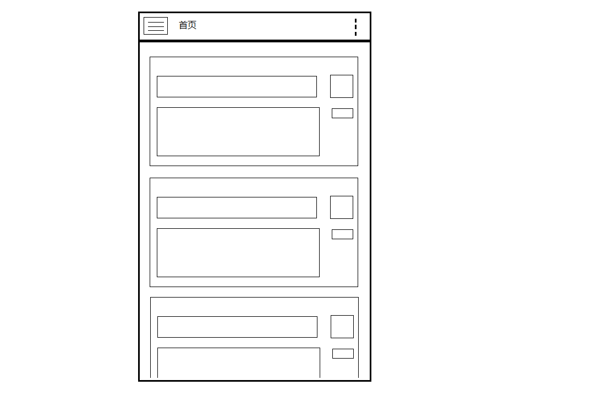
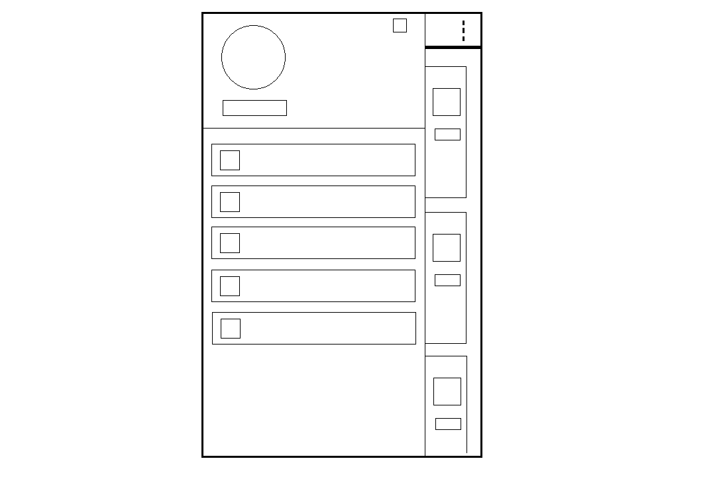
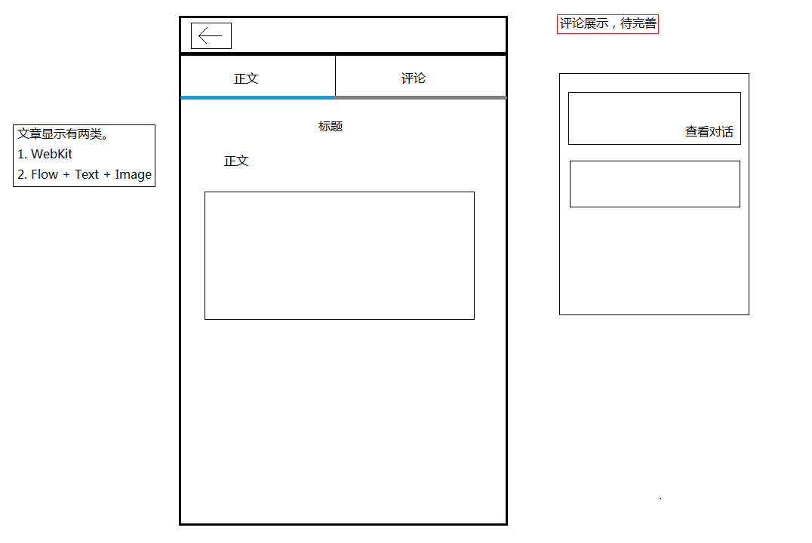
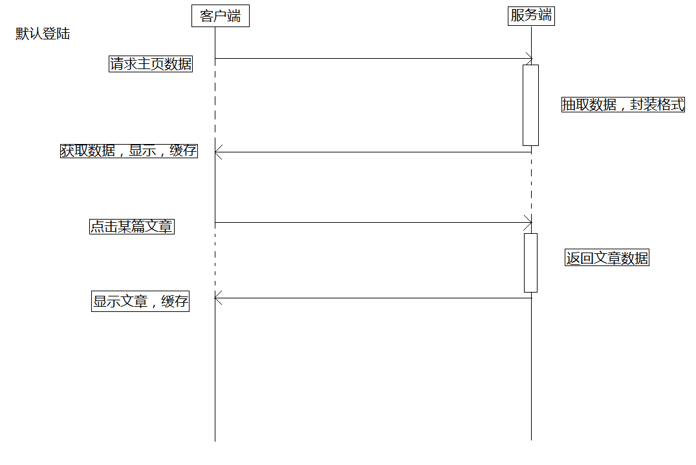

# Qt 官方博客 App(期待您的加入,无论后端还是前端)

> 作者：qyvlik

## 客户端

Qt 官方博客 App 打算采用 [V-Play](http://v-play.net/) 作为应用开发框架。

### V-Play 评估

已经对 **V-Play** 进行初级的技术评估。

在应用风格，分辨率，应用操作习惯等，都有良好的支持和可控制度。

在多平台支持方面，现阶段只在安卓上测试，**QTBUG-41170** 仍然未解决。但对总体使用影响不大。

在未来会继续对 V-Play 进行深入的评估。

### 需求列表

+ 用户登录

+ 文章查看

+ 文章收藏

+ 文章分享

+ 文章拷贝

+ 评论

### 客户端原型

---

[Android device can't friendly fix the application scene when virtual keyboard was display](https://bugreports.qt.io/browse/QTBUG-49656)。